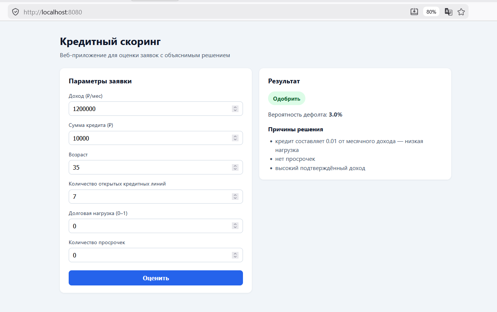
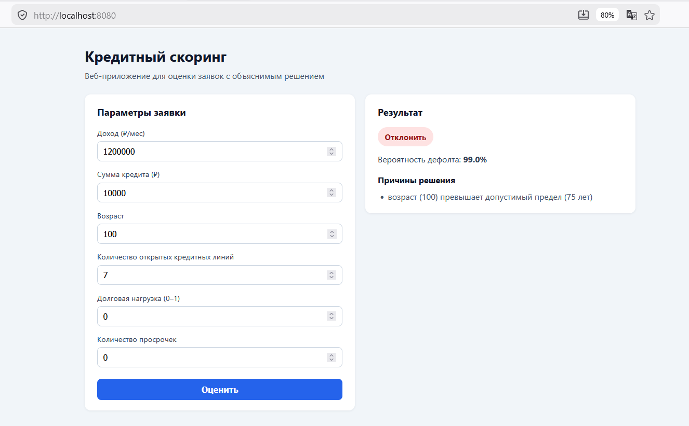
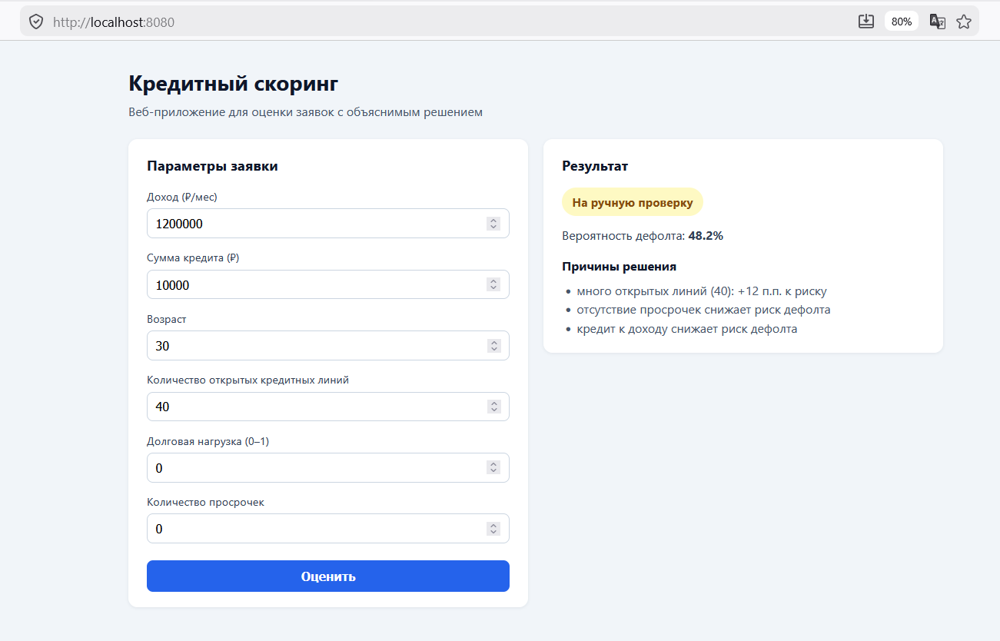
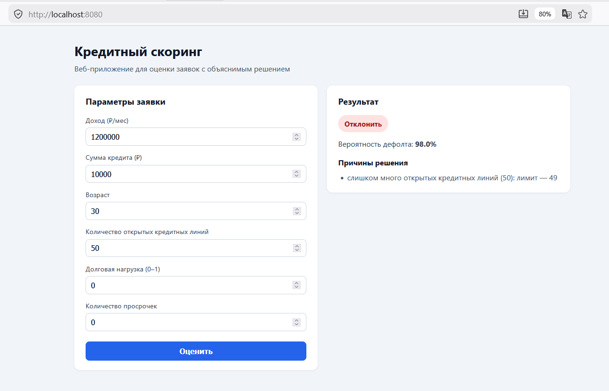
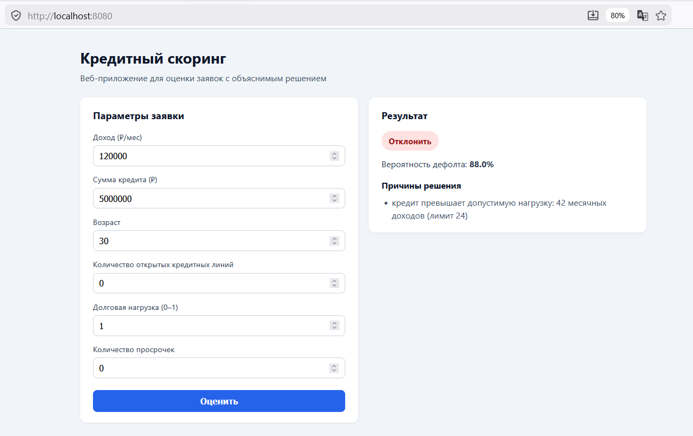
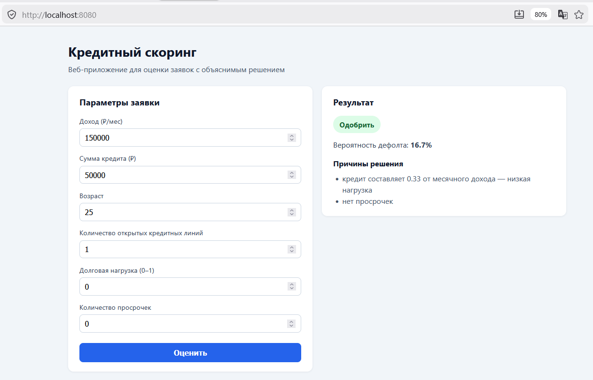
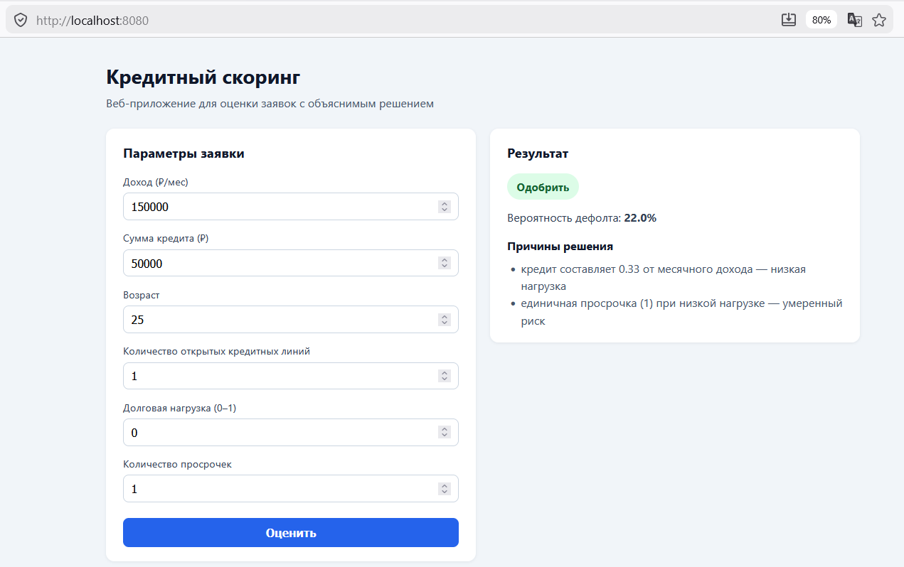

# Кредитный скоринг — итоговый проект

MVP веб-сервиса для оценки кредитных заявок: решение **APPROVE / REJECT / REVIEW**, вероятность дефолта (PD) и объяснение на русском языке.

---

## 1. Паспорт проекта

- **Название:** Кредитный скоринг (Credit Scoring API)
- **Автор:** Пархоменко Георгий Дмитриевич
- **Группа:** ИКБО-16-22
- **Контакт:** @goshanskyi_bruh

**Краткое описание.**  
Сервис принимает параметры заявки (доход, сумма кредита, возраст, число открытых кредитных линий, долговая нагрузка, просрочки), считает риск дефолта с помощью обученной модели Random Forest и бизнес-правил, возвращает решение и до трёх причин. Данные — открытый датасет [Give Me Some Credit](https://www.kaggle.com/c/GiveMeSomeCredit) (Kaggle). Baseline — логистическая регрессия; production-модель — Random Forest (ROC-AUC на test ≈ **0.84**).

---

## 2. Структура проекта

```
project/
├── app/                 # FastAPI: API, бизнес-правила, инференс, explainability
├── ml/                  # Загрузка данных, обучение, артефакты
│   ├── data/            # loader, give_me_credit, preprocessing
│   ├── training/        # train.py, eda.py, evaluate.py
│   └── artifacts/       # model.joblib, metrics.json, feature_metadata.json
├── frontend/            # React + TypeScript (форма и результат)
├── tests/               # pytest (API, бизнес-правила, датасет)
├── notebooks/           # 01_eda_give_me_credit.ipynb
├── docker-compose.yml
├── Dockerfile.api
├── Dockerfile.frontend
├── requirements.txt
├── .env.example
├── report.md            # отчёт по проекту
└── self-checklist.md    # самопроверка перед сдачей
```

Код разделён на модули (`app/`, `ml/`), а не свален в один ноутбук. Конфигурация — через переменные окружения (см. `.env.example`).

---

## 3. Требования и установка

### 3.1. Требования

- Python **≥ 3.10**
- Node.js **≥ 18** (только для локального frontend без Docker)
- Docker Desktop (опционально, для `docker compose`)

### 3.2. Установка окружения

```bash
cd project

python -m venv .venv

# Windows (PowerShell):
.venv\Scripts\activate

# Linux / macOS:
# source .venv/bin/activate

pip install --upgrade pip
pip install -r requirements.txt
```

Скопируйте при необходимости конфиг:

```bash
copy .env.example .env
```

Файл `.env` в репозиторий **не коммитится**.

---

## 4. Как запустить проект

**Быстрый старт после `git clone`:** установить зависимости (§3.2) → `docker compose up --build` или `uvicorn` (§4.3). Датасет и `model.joblib` уже в репозитории.

### 4.1. Данные и артефакты в репозитории

После `git clone` в репозитории уже лежат **датасет и обученная модель** — отдельно скачивать или обучать перед первым запуском **не обязательно**.

| Путь | Содержимое |
|------|------------|
| `ml/data/raw/cs-training.csv` | обучающая выборка Give Me Some Credit (~150k строк) |
| `ml/data/raw/cs-testing.csv` | тестовая выборка Kaggle (для возможной оценки) |
| `ml/artifacts/model.joblib` | финальная модель для API (Random Forest) |
| `ml/artifacts/model_baseline.joblib`, `model_advanced.joblib` | baseline и production-пайплайны |
| `ml/artifacts/metrics.json`, `feature_metadata.json` | метрики и метаданные признаков |
| `ml/artifacts/eda/` | графики и сводка EDA (`summary.json`, png) |

**Источник данных:** [Kaggle — Give Me Some Credit](https://www.kaggle.com/c/GiveMeSomeCredit/data).

Если файлов нет (например, использован shallow clone без LFS) — проверка и повторная загрузка:

```bash
python -m ml.data.download_data
python -m ml.data.download_data --download   # через Kaggle CLI, если настроен kaggle.json
```

Без `model.joblib` Docker-entrypoint обучит **mock-модель** (~5000 строк); в полном клоне репозитория это не требуется.

### 4.2. Переобучение модели (опционально)

```bash
cd project
.venv\Scripts\activate

# Полное обучение на Give Me Some Credit (~150k строк)
python -m ml.training.train --source give_me_credit

# Быстрый mock (без CSV, только для отладки)
python -m ml.training.train --source mock
```

Артефакты перезаписываются в `ml/artifacts/`:

| Файл | Назначение |
|------|------------|
| `model.joblib` | финальная модель для API (Random Forest + препроцессор) |
| `model_baseline.joblib` | Logistic Regression |
| `model_advanced.joblib` | Random Forest |
| `metrics.json` | сравнение метрик baseline vs advanced |
| `feature_metadata.json` | признаки и importance |

EDA:

- **Ноутбук:** `notebooks/01_eda_give_me_credit.ipynb` (интерактивный разбор)
- **Скрипт:** `python -m ml.training.eda --source give_me_credit` (те же графики в `ml/artifacts/eda/`)

### 4.3. Запуск API (локально)

```bash
cd project
.venv\Scripts\activate
uvicorn app.main:app --reload --host 0.0.0.0 --port 8000
```

- **Health:** http://localhost:8000/health  
- **Swagger:** http://localhost:8000/docs  
- **Predict:** `POST http://localhost:8000/predict`

Пример запроса (PowerShell):

```powershell
Invoke-RestMethod -Method Post -Uri http://localhost:8000/predict `
  -ContentType "application/json" `
  -Body '{"income":120000,"loan_amount":50000,"age":35,"credit_history":7,"debt_ratio":0.31,"late_payments":0}'
```

Пример (`curl`, bash):

```bash
curl -X POST http://localhost:8000/predict \
  -H "Content-Type: application/json" \
  -d '{"income":120000,"loan_amount":50000,"age":35,"credit_history":7,"debt_ratio":0.31,"late_payments":0}'
```

**Ответ** (поля `reasons` — от 1 до 3 строк на русском):

```json
{
  "decision": "APPROVE",
  "probability": 0.22,
  "reasons": ["кредит составляет 0.42 от месячного дохода — низкая нагрузка", "нет просрочек"]
}
```

### 4.4. Запуск frontend (локально)

```bash
cd project/frontend
npm install
npm run dev
```

UI: http://localhost:5173 (прокси на API — см. `vite.config.ts`).

### 4.5. Запуск через Docker (рекомендуется для демо)

```bash
cd project
docker compose up --build
```

| Сервис | URL |
|--------|-----|
| **Веб-интерфейс** | http://localhost:8080 |
| **API** | http://localhost:8000 |
| **Swagger** | http://localhost:8000/docs |

Остановка: `docker compose down`.

Папка `ml/artifacts/` монтируется в контейнер — используется `model.joblib` из репозитория; после переобучения на хосте новая модель подхватывается без пересборки образа.

Модель привязана к `scikit-learn==1.7.2` из `requirements.txt`. Если после обновления sklearn появляются ошибки на `/predict` — пересоберите образ (`docker compose build --no-cache api`) и при необходимости переобучите модель.

---

## 5. API

### `GET /health`

Проверка работоспособности сервиса.

```json
{"status": "ok"}
```

### `POST /predict`

**Тело запроса:**

| Поле | Тип | Описание |
|------|-----|----------|
| `income` | float | Ежемесячный доход, ₽ |
| `loan_amount` | float | Сумма кредита, ₽ |
| `age` | int | Возраст (18–100) |
| `credit_history` | int | Число открытых кредитных линий (0–80) |
| `debt_ratio` | float | Долговая нагрузка (0–1) |
| `late_payments` | int | Количество просрочек (по умолчанию 0) |

**Логика решения:**

1. **Бизнес-правила** — до ML: авто-**APPROVE** (низкая нагрузка, возраст 21–70, 1–20 кредитных линий, ≤1 просрочка) или авто-**REJECT** (возраст >75, ≥50 линий, ≥3 просрочек, кредит >24× дохода и др.).  
2. **ML** — `RandomForest` на 7 признаках (включая `loan_to_income`).  
3. **Post-ML штрафы** — корректировка PD за возраст, кредитные линии, просрочки, кредит к доходу, долг.  
4. **Пороги PD** — <0.25 → APPROVE; >0.55 → REJECT; иначе REVIEW.  
5. **Объяснение** — на ML-пути: SHAP или fallback по feature importance; при срабатывании правил — текстовые причины из `business_rules.py`.

Пороги и штрафы — в `.env.example` / `app/core/config.py`.

---

## 6. Данные

| Give Me Some Credit | Поле API |
|---------------------|----------|
| `MonthlyIncome` | `income` |
| `DebtRatio` × `MonthlyIncome` | `loan_amount` |
| `age` | `age` |
| `NumberOfOpenCreditLinesAndLoans` | `credit_history` |
| `DebtRatio` (нормализация) | `debt_ratio` |
| сумма колонок просрочек | `late_payments` |
| `SeriousDlqin2yrs` | целевая переменная `default` |

Файлы `cs-training.csv` и `cs-testing.csv` **включены в репозиторий** (`ml/data/raw/`) для воспроизводимости после клонирования.

---

## 7. Модели и метрики

Сравнение на hold-out (см. `ml/artifacts/metrics.json`):

| Модель | ROC-AUC | Precision | Recall |
|--------|---------|-----------|--------|
| Logistic Regression (baseline) | 0.823 | 0.243 | 0.641 |
| Random Forest (production) | **0.840** | 0.233 | 0.686 |

Финальная модель: **Random Forest** — лучше по ROC-AUC при сопоставимой сложности инференса.

Подробное обоснование — в [`report.md`](report.md).

---

## 8. Тесты

```bash
cd project
.venv\Scripts\activate
pytest tests -v
```

Покрытие (22 теста): `/health`, `/predict` (ML, auto-approve, hard reject), маппинг Give Me Some Credit, бизнес-правила.

---

## 9. Демонстрация на защите

**Запуск:** `docker compose up --build` → http://localhost:8080

**Сценарии в UI:**

1. **Одобрение** — доход 1 200 000 ₽, кредит 10 000 ₽, возраст 35, **credit_history 5–7**, debt 0, 0 просрочек → APPROVE (часто через бизнес-правила), низкая PD.



2. **Отказ по возрасту** — те же поля, возраст **100** → REJECT (возраст > 75).



3. **Отказ по кредитным линиям** — `credit_history` **50** → REJECT.





4. **Отказ по кредиту** — доход 120 000 ₽, кредит **5 000 000** ₽ → REJECT (нагрузка к доходу).



5. **ML + штрафы** — умеренный профиль с 2–3 просрочками → REVIEW или REJECT с причинами в ответе.






**Дополнительно показать:**

- Swagger `/docs` и `GET /health`
- `ml/artifacts/metrics.json` — сравнение baseline vs RF
- Структуру `app/core/business_rules.py` (прозрачные правила поверх ML)

---

## 10. Ограничения и дальнейшая работа

- Нет персистентного хранения заявок и авторизации.
- `loan_amount` в датасете — оценка из DebtRatio × Income, не фактическая сумма из банка.
- Explainability — SHAP на одной строке; для production нужен batch/кэш.
- Нет отдельной оценки на `cs-testing.csv` (файл в `ml/data/raw/`, метрики только на hold-out 20% из train).

Возможные улучшения: CatBoost/LightGBM, калибровка PD, MLflow, мониторинг дрейфа.

---

## 11. Связанные документы

| Файл | Содержание |
|------|------------|
| [`report.md`](report.md) | Отчёт: задача, данные, эксперименты |
| [`self-checklist.md`](self-checklist.md) | Чеклист самопроверки (10 критериев) |
| [`project-evaluation.md`](project-evaluation.md) | Критерии оценки курса |
| [`.env.example`](.env.example) | Все переменные окружения |

---

## 12. Оценка проекта (кратко)

Итоговая оценка — по [`project-evaluation.md`](project-evaluation.md) и заполненному [`self-checklist.md`](self-checklist.md) (самооценка 10/10). Критерии: рабочий сервис, EDA, сравнение моделей, документация, Docker.
