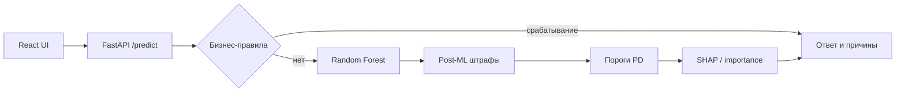

# Отчёт по итоговому проекту по курсу «Инженерия Искусственного Интеллекта»

**Тема:** веб-сервис кредитного скоринга с объяснимым решением.

---

## 1. Паспорт проекта

- **Название проекта:** Кредитный скоринг (Credit Scoring API)
- **Автор:** Пархоменко Георгий Дмитриевич
- **Группа:** ИКБО-16-22
- **Контакт:** @goshanskyi_bruh
- **Ссылка на репозиторий:** https://github.com/Goshansky/mirea-aie (папка `project/`)

Проект — end-to-end MVP для оценки кредитных заявок: пользователь вводит параметры заявки в веб-форме, backend возвращает решение (**APPROVE / REJECT / REVIEW**), оценку вероятности дефолта (PD) и до трёх причин на русском языке. В основе — классические модели машинного обучения на табличных данных, бизнес-правила для крайних случаев и SHAP/feature importance для explainability.

---

## 2. Постановка задачи и контекст

### 2.1. Предметная область

**Задача:** бинарная классификация — предсказать, допустит ли заемщик серьёзную просрочку (дефолт) в горизонте двух лет.

**Пользователи:**

- сотрудник риск-подразделения или оператор, который вводит параметры заявки и получает рекомендацию;
- разработчик/аналитик, интегрирующий API в смежные системы.

**Сценарий:** оператор заполняет форму (доход, сумма кредита, возраст, число открытых кредитных линий, долговая нагрузка, просрочки) → сервис возвращает решение, PD и объяснение → при пограничном риске заявка уходит на ручную проверку (**REVIEW**).

### 2.2. Формулировка в терминах ML

| Элемент | Описание |
|---------|----------|
| **Вход** | 6 признаков заявки + производный `loan_to_income = loan_amount / income` |
| **Выход модели** | Вероятность дефолта \(P(default=1)\) |
| **Выход сервиса** | Категориальное решение + PD + список причин |
| **Целевая переменная** | `SeriousDlqin2yrs` (дефолт за 2 года) |

**Требования:**

- **Интерпретируемость** — объяснение решения для оператора (SHAP / importance, бизнес-правила с текстовыми причинами).
- **Устойчивость к абсурдным заявкам** — явные hard rules (огромный кредит при малом доходе, экстремальный возраст, десятки кредитных линий).
- **Скорость инференса** — классические модели (логистическая регрессия, Random Forest), инференс на одной строке в миллисекундах.
- **Воспроизводимость** — фиксированный `random_state`, версии библиотек в `requirements.txt`, датасет и артефакты (`model.joblib`, метрики) **закоммичены в репозиторий**.

### 2.3. Целевые метрики

| Метрика | Зачем |
|---------|--------|
| **ROC-AUC** | Основная метрика ранжирования риска; устойчива к дисбалансу классов |
| **Precision** | Доля верно предсказанных дефолтов среди заявок, классифицированных моделью как дефолт (при пороге 0.5 на test) |
| **Recall** | Доля пойманных дефолтов среди всех дефолтов |

Дополнительно в сервисе используются **пороги PD** (`THRESHOLD_APPROVE=0.25`, `THRESHOLD_REJECT=0.55`) для зоны **REVIEW** — это бизнес-решение, а не метрика обучения.

---

## 3. Данные

### 3.1. Источник

Открытый датасет соревнования Kaggle **[Give Me Some Credit](https://www.kaggle.com/c/GiveMeSomeCredit)**.

В репозитории **уже включены** (воспроизводимость после `git clone`):

| Файл | Назначение |
|------|------------|
| `ml/data/raw/cs-training.csv` | обучающая выборка (~150 000 строк) |
| `ml/data/raw/cs-testing.csv` | тестовая выборка Kaggle |
| `ml/artifacts/model.joblib` | финальная модель для API |
| `ml/artifacts/metrics.json`, `feature_metadata.json` | метрики и importance |
| `ml/artifacts/model_baseline.joblib`, `model_advanced.joblib` | сохранённые пайплайны обучения |

Повторная загрузка с Kaggle — опционально (`python -m ml.data.download_data`, см. `ml/data/README.md`), если файлы отсутствуют локально.

Для отладки без CSV реализован **mock-датасет** (`ml/data/loader.py`, `--source mock`); в штатном сценарии сдачи проекта не используется.

### 3.2. Структура и маппинг в API

Исходные колонки Kaggle приводятся к единому формату API (`ml/data/give_me_credit.py`):

| Kaggle | Поле API | Тип |
|--------|----------|-----|
| `MonthlyIncome` | `income` | float |
| `DebtRatio` × `MonthlyIncome` | `loan_amount` | float (оценка обязательств) |
| `age` | `age` | int |
| `NumberOfOpenCreditLinesAndLoans` | `credit_history` | int |
| `DebtRatio` (winsorize 99% → [0, 1]) | `debt_ratio` | float |
| сумма колонок просрочек (30/60/90 дней) | `late_payments` | int |
| `SeriousDlqin2yrs` | `default` | 0/1 |

Производный признак: **`loan_to_income`** — отражает нагрузку кредита относительно дохода и устраняет рассинхрон, когда в форме `loan_amount` и `debt_ratio` задаются независимо.

### 3.3. Предобработка

1. Пропуски `MonthlyIncome` → медиана.
2. `DebtRatio` — обрезка выбросов (99-й перцентиль), нормализация в [0, 1].
3. `age` — clip 18–100; `credit_history` — clip 0–80.
4. Просрочки — сумма трёх полей, clip 0–50.
5. Обучение: `ColumnTransformer` с `StandardScaler` для числовых признаков (`ml/data/preprocessing.py`).

### 3.4. EDA и наблюдения

Разведочный анализ:

- **Ноутбук:** `notebooks/01_eda_give_me_credit.ipynb` (основной интерактивный отчёт);
- **Скрипт:** `python -m ml.training.eda --source give_me_credit`.

Артефакты в `ml/artifacts/eda/`:

- `summary.json`, `missing_values.csv` — сводка и пропуски;
- `target_distribution.png`, `debt_ratio_hist.png`, `correlation_heatmap.png`;
- `features_late_credit.png` — распределения просрочек и числа кредитных линий.

**Основные выводы EDA (типично для Give Me Some Credit):**

- **Сильный дисбаланс классов:** доля дефолта порядка 6–7%, что требует `class_weight` при обучении и осторожности с accuracy.
- **Пропуски** в основном в `MonthlyIncome` — заполняются медианой.
- **Просрочки и возраст** — наиболее информативные признаки (подтверждается feature importance финальной модели).
- **Высокий DebtRatio и много открытых линий** коррелируют с повышенным риском.

---

## 4. Модели и подходы

### 4.1. Baseline — Logistic Regression

- Pipeline: `StandardScaler` + `LogisticRegression(max_iter=1200, class_weight="balanced")`.
- Простая интерпретируемая точка отсчёта, быстрый инференс.
- Код: `ml/training/train.py`, артефакт `model_baseline.joblib`.

### 4.2. Улучшенная модель — Random Forest

- `RandomForestClassifier`: `n_estimators=400`, `max_depth=10`, `min_samples_leaf=3`, `class_weight="balanced_subsample"`.
- Лучше улавливает нелинейности и взаимодействия признаков без ручного feature engineering.
- Код: `ml/training/train.py`, артефакты `model_advanced.joblib`, **`model.joblib`** (финальная для API).

### 4.3. Дополнительные элементы

- Признак **`loan_to_income`** добавлен в обучение и в post-ML бизнес-правила.
- **Бизнес-правила** (`app/core/business_rules.py`):
  - авто-**APPROVE**: `loan_to_income` ≤3, `debt_ratio` ≤0.35, ≤1 просрочка, возраст 21–70, 1–20 кредитных линий;
  - авто-**REJECT**: возраст >75, ≥50 кредитных линий, ≥3 просрочек, `loan_to_income` >24, доход <15k ₽;
  - post-ML штрафы к PD за возраст, thin file (0 линий), перегруз линиями, просрочки, долг.
- **Explainability:** SHAP `TreeExplainer` для Random Forest; fallback — взвешенный вклад по `feature_importance` из `feature_metadata.json`.

### 4.4. Нейросетевые модели

Не использовались: для табличных данных с умеренным объёмом классические модели дают сопоставимое качество при меньшей сложности деплоя. При развитии проекта возможен MLP как эксперимент.

---

## 5. Экспериментальный протокол и результаты

### 5.1. Протокол

- **Разбиение:** `train_test_split`, 80% / 20%, `stratify=y`, `random_state=42`.
- **Метрики на test:** ROC-AUC, Precision, Recall при пороге классификации 0.5 (для сравнения моделей; в API пороги решения другие).
- **Команда обучения:**

```bash
cd project
python -m ml.training.train --source give_me_credit
```

- Результаты фиксируются в `ml/artifacts/metrics.json` (файл уже в репозитории; пересчитывается при переобучении).

### 5.2. Сравнение моделей

Данные: Give Me Some Credit, **150 000** строк.

| Модель | Описание | ROC-AUC | Precision | Recall |
|--------|----------|---------|-----------|--------|
| **Baseline** | Logistic Regression, 7 признаков | **0.823** | 0.243 | 0.641 |
| **Production** | Random Forest (400 деревьев, depth=10) | **0.840** | 0.233 | 0.686 |

Источник: `ml/artifacts/metrics.json` (фактический прогон на hold-out 20%).

### 5.3. Выбор финальной модели

**Выбрана Random Forest** (`selected_model: advanced_random_forest`).

**Обоснование:**

1. **ROC-AUC +0.017** относительно baseline — заметное улучшение ранжирования риска.
2. **Recall выше** (0.686 vs 0.641) — модель чаще находит будущие дефолты, что важно для скоринга.
3. **Инференс** остаётся быстрым на одной заявке; модель сериализуется в `joblib` вместе с препроцессором.
4. **Совместимость с SHAP** для объяснений в UI.

**Trade-off:** Precision чуть ниже — при фиксированном пороге 0.5 больше ложных срабатываний; в сервисе это смягчается зоной **REVIEW** и бизнес-правилами.

### 5.4. Важность признаков (Random Forest)

| Признак | Доля importance |
|---------|-----------------|
| `late_payments` | ~61% |
| `age` | ~11% |
| `loan_to_income` | ~7% |
| `credit_history` | ~6% |
| `loan_amount`, `income` | ~6% каждый |
| `debt_ratio` | ~3% |

Источник: `ml/artifacts/feature_metadata.json`.

---

## 6. Архитектура решения и сервис

### 6.1. Пайплайн



1. **Обучение (offline):** `ml/data/raw/cs-training.csv` → `ml/training/train.py` → `ml/artifacts/model.joblib` (модель в репозитории; переобучение опционально).
2. **Инференс (online):** `PredictRequest` → favorable/hard rules → ML `predict_proba` → корректировка PD → `resolve_decision` → explainability.

### 6.2. API

| Endpoint | Метод | Назначение |
|----------|-------|------------|
| `/health` | GET | Проверка работоспособности |
| `/predict` | POST | Скоринг заявки |

**Тело `POST /predict`:**

```json
{
  "income": 120000,
  "loan_amount": 50000,
  "age": 35,
  "credit_history": 7,
  "debt_ratio": 0.31,
  "late_payments": 0
}
```

**Ответ** (`reasons` — от 1 до 3 строк):

```json
{
  "decision": "APPROVE",
  "probability": 0.22,
  "reasons": ["кредит составляет 0.42 от месячного дохода — низкая нагрузка", "нет просрочек"]
}
```

**Логика решения:**

1. Срабатывают **бизнес-правила** → ответ сразу (ML и SHAP не вызываются).
2. Иначе **ML** → PD, post-ML штрафы → пороги: PD < 0.25 **APPROVE**, PD > 0.55 **REJECT**, иначе **REVIEW**.
3. Объяснение: SHAP / feature importance на ML-пути; при правилах — готовые формулировки из кода.

Пороги и штрафы — `.env.example`, `app/core/config.py`.

### 6.3. Технологический стек

| Компонент | Технологии |
|-----------|------------|
| Backend | Python 3.10+, FastAPI, Pydantic, scikit-learn 1.7.2, SHAP, joblib |
| Frontend | React, TypeScript, Vite |
| ML | pandas, sklearn Pipeline, RandomForest, LogisticRegression |
| Тесты | pytest (22 теста), FastAPI TestClient |
| Deploy | Docker Compose (API :8000, UI :8080) |

**Запуск:** см. [`README.md`](README.md) (разделы 3–4, Docker Compose).

```bash
docker compose up --build
```

---

## 7. Наблюдаемость, конфигурация и безопасность

### 7.1. Логи и наблюдаемость

- Структурированное логирование через `logging` (`app/core/logging.py`).
- HTTP middleware логирует метод, путь, статус и время ответа.
- При скоринге пишутся события: срабатывание бизнес-правил, ML PD, итоговое решение.
- **`GET /health`** — проверка живости для Docker healthcheck и мониторинга.

### 7.2. Конфигурация

Параметры вынесены в переменные окружения (`app/core/config.py`, шаблон [`.env.example`](.env.example)):

- пороги PD (`THRESHOLD_APPROVE`, `THRESHOLD_REJECT`);
- лимиты дохода и `loan_to_income`;
- пороги и штрафы по возрасту, просрочкам, кредитным линиям;
- пути к артефактам (`ARTIFACTS_DIR`, `MODEL_FILE`).

Переключение поведения без изменения кода — через `.env` или `docker-compose.yml`.

### 7.3. Безопасность

- Файл **`.env` не коммитится** (см. корневой `.gitignore`).
- В репозитории только **`.env.example`** без секретов.
- Датасет — **обезличенный открытый** Kaggle; персональные данные не используются.
- CSV и артефакты ML **включены в git** для проверки и демо без отдельной загрузки; секреты (токены Kaggle и т.п.) в репозиторий не попадают.

---

## 8. Ограничения и дальнейшая работа

**Ограничения текущей версии:**

- `loan_amount` в обучающей выборке — **оценка** из DebtRatio × Income, а не фактическая сумма заявки из банка.
- Нет хранения истории заявок, аутентификации и rate limiting.
- Explainability — SHAP на одной строке; для высокой нагрузки нужен кэш/батч.
- Отдельная оценка на `cs-testing.csv` (официальный hold-out Kaggle) не проводилась — метрики только на 20% split из `cs-training.csv`.

**Планы развития:**

- CatBoost / LightGBM, калибровка вероятностей (Platt / isotonic).
- MLflow для трекинга экспериментов.
- Мониторинг дрейфа признаков и PD в production.
- Расширение API: batch-predict, версионирование моделей.

---

## 9. Сценарий демонстрации на защите

### 9.1. Что запускаю

```bash
git clone https://github.com/Goshansky/mirea-aie.git
cd mirea-aie/project
docker compose up --build
```

Датасет и `model.joblib` уже в репозитории — отдельное обучение перед демо не требуется.

Открываю **http://localhost:8080** (UI) и при необходимости **http://localhost:8000/docs** (Swagger).

### 9.2. Ключевые сценарии

| # | Ввод (суть) | Ожидаемый результат |
|---|-------------|---------------------|
| 1 | Доход 1.2M ₽, кредит 10k ₽, возраст 35, credit_history 5–7, 0 просрочек | **APPROVE**, низкая PD (часто бизнес-правила) |
| 2 | Те же поля, возраст **100** | **REJECT** — возраст выше лимита |
| 3 | `credit_history` **50** | **REJECT** — слишком много линий |
| 4 | Доход 120k ₽, кредит **5M** ₽ | **REJECT** — нереалистичная нагрузка к доходу |
| 5 | 2–3 просрочки, умеренный профиль | **REVIEW** или **REJECT**, причины с штрафами к PD |

Пример запроса к API (из README):

```bash
curl -X POST http://localhost:8000/predict \
  -H "Content-Type: application/json" \
  -d '{"income":120000,"loan_amount":50000,"age":35,"credit_history":7,"debt_ratio":0.31,"late_payments":0}'
```

### 9.3. На что обратить внимание

1. **Полный инженерный цикл:** данные Kaggle → обучение → артефакты → API → UI → Docker.
2. **Сравнение моделей** — таблица в §5 и файл `ml/artifacts/metrics.json`.
3. **Прозрачность:** бизнес-правила поверх ML + объяснения на русском.
4. **Устойчивость:** система не одобряет абсурдные заявки (возраст 100, кредит >> дохода).

Подробные команды запуска и структура репозитория — в [`README.md`](README.md).  
Самопроверка по критериям курса — в [`self-checklist.md`](self-checklist.md).
